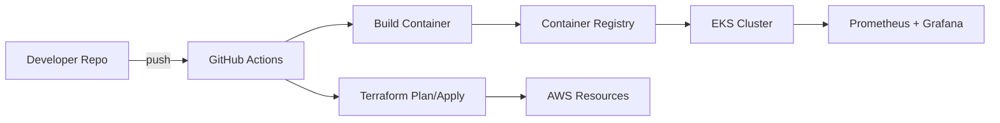

# Hi, I'm Leela Vardhan 👋

**AWS DevOps Engineer | Terraform · Kubernetes · CI/CD · Python**

---

## ⚡ Quick Summary

* 🔧 3 years building scalable infra on AWS
* 🧩 Focus: Infrastructure as Code, CI/CD automation, containers, monitoring
* 🛠️ Tools: Terraform, AWS (EC2, EKS, Lambda), Docker, GitHub Actions, Prometheus
* 📫 Reach me: [LinkedIn](https://www.linkedin.com/in/leela-vardhan-76600b1b2)(mailto:mleelavardhan@gmail.com)

---

## 🔭 Currently

Working on: *Automating multi-environment deployments with Terraform + GitHub Actions*.

---

## 📌 Pinned Projects

1. **terraform-aws-baseline** — Reusable Terraform modules for secure AWS baseline (VPC, IAM, logging).

   * `README.md` contains architecture diagram, usage, example variables.
   * Tags: `terraform`, `aws`, `modules`

2. **ci-cd-github-actions** — End-to-end pipeline: build, test, containerize, deploy to EKS/EC2.

   * Includes GitHub Actions workflows and sample Helm charts.

3. **microservice-on-eks** — Small demo microservice (Flask) with Dockerfile, k8s manifests, helm chart.

4. **lambda-serverless-utils** — Serverless examples using AWS SAM + automation scripts.

---

## 🛠️ Tech Stack

```
Cloud: AWS (EC2, EKS, Lambda, S3, CloudWatch)
IaC: Terraform, CloudFormation
CI/CD: GitHub Actions, Jenkins
Containers: Docker, Kubernetes (EKS), Helm
Languages: Python, Bash
Monitoring: Prometheus, Grafana, CloudWatch
Security: IAM, KMS, AWS Config
```

---

## 🧭 Architecture (example)



---

## 📂 How to reproduce a project (example)

1. `git clone https://github.com/Leelavardhan-git/terraform-aws-baseline.git`
2. `cd terraform-aws-baseline/example`
3. `terraform init` → `terraform plan` → `terraform apply`

> ⚠️ **Safety**: Use a separate AWS account or sandbox when running examples. Remove created resources to avoid costs: `terraform destroy`.

---

## 📈 GitHub Stats & Activity


---

## 📝 Blog & Talks

* [My devops blog post: Automating blue-green deploys](https://your-blog.example.com)
* Presented at: *Local Cloud Meetup — "IaC Practices"*

---

## 💡 Tips for contributors

* Read `CONTRIBUTING.md` in each repo.
* Open issues for feature requests or bug reports.

---

## 📫 Contact

* LinkedIn: [https://www.linkedin.com/in/leela-vardhan-76600b1b2](https://www.linkedin.com/in/leela-vardhan-76600b1b2)
* Email: [mleelavardhan@gmail.com](mailto:mleelavardhan@gmail.com)

---

*Made with ❤️ using Terraform, GitHub Actions and coffee.*
